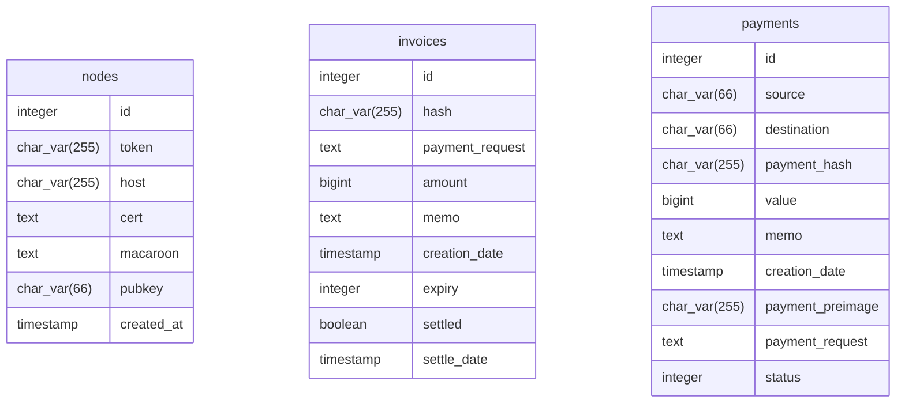
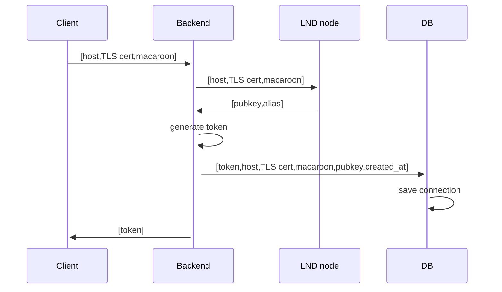
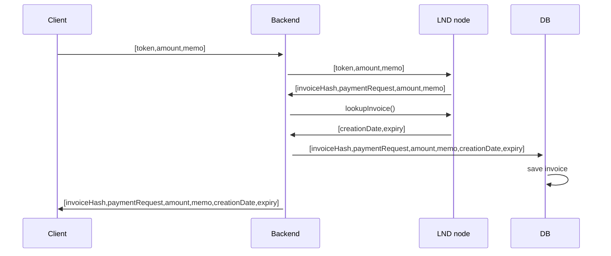
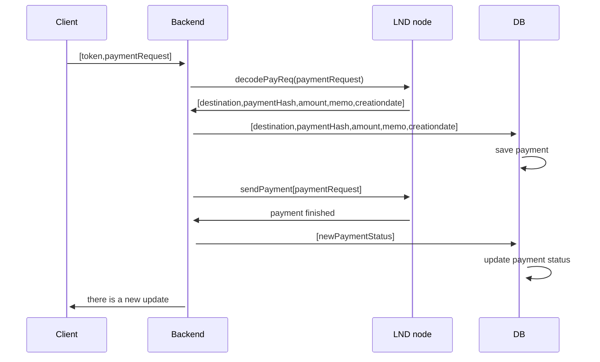

# Architecture Documentation

This document outlines the architectural decisions and system design for the LN Payment application.

## System Overview

The application is a full-stack solution designed to facilitate Lightning Network payments between two nodes. It consists of a React frontend (Next.js), a Node.js backend (Express), and a PostgreSQL database.

### Components

1. **Frontend (Next.js)**:
   - Provides a user interface for "Receiver" and "Sender" roles.
   - Manages LND node connection states.
   - Polls/Listens for payment updates (via Socket.io).

2. **Backend (Express)**:
   - Acts as a bridge between the frontend and LND nodes.
   - Handles gRPC communication with LND using `@radar/lnrpc`.
   - Manages multiple node connections via a `NodeManager` class.
   - Persists transaction data to PostgreSQL.

3. **Database (PostgreSQL)**:
   - Stores metadata for all invoices generated and payments made.
   - Maintains a record of connected nodes for session management.

4. **Lightning Nodes (Polar/LND)**:
   - The actual Lightning Network nodes that handle the protocol logic.

```ascii
ln-payment/
├── backend/                  # Express server
│   ├── src/
│   │   ├── database.ts       # PostgreSQL connection & queries
│   │   ├── index.ts          # Application entry point
│   │   ├── node-manager.ts   # LND gRPC connection handler
│   │   ├── routes.ts         # API route definitions
│   │   └── server.ts         # Express server setup
│   ├── tests/                # Backend tests
│   ├── Dockerfile            # Backend container configuration
│   └── package.json          # Backend dependencies
│
├── frontend/                 # Next.js server
│   ├── src/
│   │   ├── app/              # Next.js App Router pages
│   │   │   ├── balance/      # Balance page
│   │   │   ├── receiver/     # Receiver / Invoice generation page
│   │   │   ├── sender/       # Sender / Payment execution page
│   │   │   └── transactions/ # Transaction history page
│   │   ├── components/       # React UI components
│   │   ├── hooks/            # Custom React hooks
│   │   ├── providers/        # Context providers
│   │   ├── styles/           # Global styles
│   │   └── utils/            # Helper functions
│   ├── Dockerfile            # Frontend container configuration
│   ├── .env.local            # Frontend environment variables
│   └── package.json          # Frontend dependencies
│
├── docs/                     # Project documentation
│
├── compose.yaml              # Docker Compose configuration
├── .env                      # Project environment variables
├── package.json              # Project dependencies (code formatting)
└── README.md                 # Project overview
```

## Architecture Decisions

### 1. Multi-Node Management

Instead of hardcoding a single node's credentials, the backend is designed to handle multiple node connections. Each connection is assigned a unique session token. This allows the same backend instance to serve both the sender and the receiver roles concurrently.

### 2. Transaction Persistence

While LND keeps its own record of invoices and payments, it duplicates this data in a local PostgreSQL database.

- **Rationale**: This improves query performance for the frontend (listing transactions, calculating balance) and ensures that we have a record that survives even if nodes are reset or changed in the development environment. It also allows us to store extra metadata or link transactions across nodes more easily.

### 3. Asynchronous Payment Handling

Payment execution is handled using LND's `sendPaymentV2` (Router RPC), which is a streaming API.

- **Rationale**: Payments in the Lightning Network can take time to route. By using the streaming API, the backend can immediately acknowledge the payment request to the frontend and then update the database status (Succeeded/Failed) asynchronously as the stream provides updates.

### 4. Dockerization

The entire stack is containerized using Docker Compose.

- **Rationale**: Ensures a consistent development environment across different machines. It also simplifies the networking between the backend and the Polar nodes by using an external network bridge.

## Database Schema



## Data Flow

### Connection to LND node



### Invoice creation



### Payment execution

